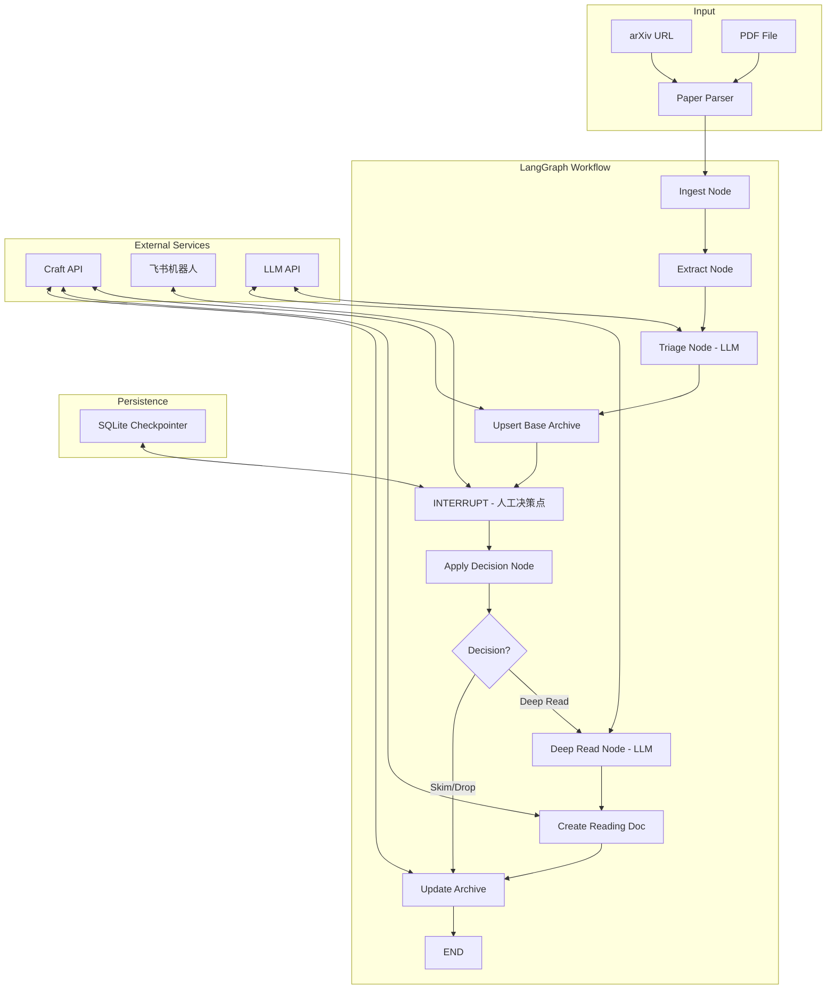
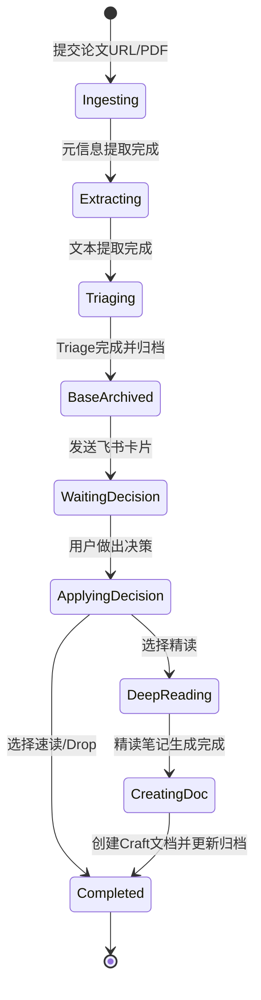
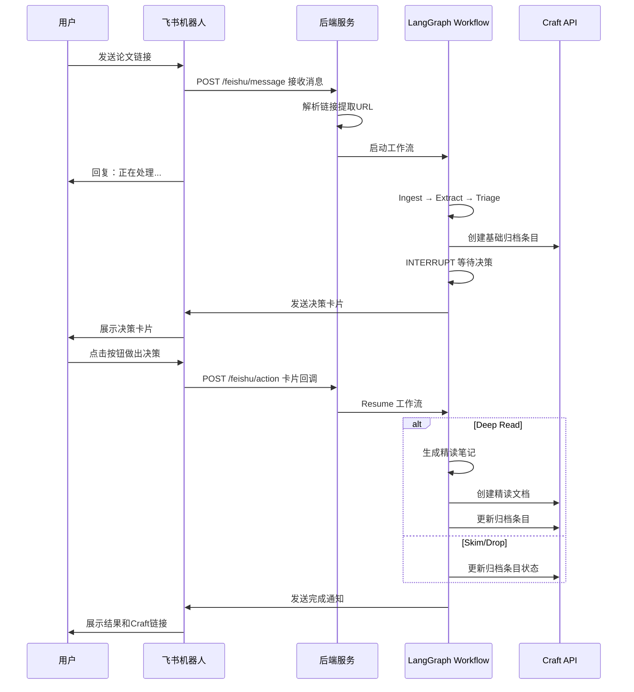

# 论文自动归档系统 - 实现方案

## 1. 项目概述

基于 LangGraph 构建的半自动论文归档系统，支持：
- **飞书机器人作为主要入口** - 发送论文链接即可启动处理流程
- 论文 URL → LLM 自动 Triage → 人工决策（飞书卡片）→ 归档到 Craft
- 支持自定义 LLM（可配置 base_url、api_key、model）

## 2. 系统架构



## 3. 工作流状态图



## 4. 数据结构设计

### 4.1 Craft Collection Schema（论文统计）

| 字段 Key | 字段名 | 类型 | 说明 |
|----------|--------|------|------|
| title | Title | string | 论文标题 |
| `` | 文章方向 | multi-select | AI Infra, MultiMode, Agent, Context Engineering, Memory, Agent协作, Coding, Reasoning, Bench, Pre-Training, LLM, Post-Training, RAG |
| _2 | 链接 | URL | 论文原始链接 |
| _3 | 概要 | text | LLM 生成的概要 |
| _4 | 原文阅读 | block link | 链接到精读文档 |
| _5 | 是否精读 | single-select | Yes / No |
| _6 | 速读链接 | URL | 速读笔记链接（可选） |
| _7 | 评论 | text | 个人评论 |

### 4.2 精读模板结构

```markdown
# 论文精读模版

## 📜 文章概述
[LLM 生成的详细概述]

## 💡创新点
[LLM 分析的创新点]

## 🌌可能结合的方向
[LLM 建议的研究方向]

## 🤔思考和感想
[用户后续填写]
```

### 4.3 LangGraph State Schema

```python
from typing import TypedDict, Optional, List, Literal
from enum import Enum

class DecisionType(str, Enum):
    DEEP_READ = "deep_read"
    SKIM = "skim"
    DROP = "drop"

class PaperState(TypedDict):
    # 输入
    paper_id: str  # 由 URL/DOI hash 生成
    source_url: str
    source_type: Literal["arxiv", "pdf", "url"]
    
    # 元信息
    title: Optional[str]
    authors: Optional[List[str]]
    year: Optional[int]
    abstract: Optional[str]
    
    # 提取的内容
    full_text: Optional[str]
    
    # Triage 结果
    triage_summary: Optional[str]  # 概要
    triage_contributions: Optional[str]  # 贡献点
    triage_limitations: Optional[str]  # 局限性
    triage_relevance: Optional[int]  # 相关性评分 1-5
    triage_suggested_action: Optional[DecisionType]  # LLM 建议
    triage_suggested_tags: Optional[List[str]]  # 建议的文章方向
    
    # Craft 归档
    craft_collection_item_id: Optional[str]
    craft_reading_doc_id: Optional[str]
    
    # 人工决策
    human_decision: Optional[DecisionType]
    human_tags: Optional[List[str]]
    human_comment: Optional[str]
    
    # Deep Read 结果
    deep_read_overview: Optional[str]  # 📜 文章概述
    deep_read_innovations: Optional[str]  # 💡创新点
    deep_read_directions: Optional[str]  # 🌌可能结合的方向
    
    # 状态
    status: Literal["ingesting", "extracting", "triaging", "waiting_decision", "deep_reading", "completed", "failed"]
    error_message: Optional[str]
```

### 4.4 飞书卡片 Payload

```json
{
  "paper_id": "abc123",
  "title": "论文标题",
  "source_url": "https://arxiv.org/abs/...",
  "triage_summary": "这篇论文提出了...",
  "triage_contributions": "1. xxx\n2. xxx",
  "triage_relevance": 4,
  "triage_suggested_action": "deep_read",
  "triage_suggested_tags": ["Agent", "Reasoning"],
  "actions": [
    {"label": "📖 精读", "value": "deep_read"},
    {"label": "👀 速读", "value": "skim"},
    {"label": "🗑️ Drop", "value": "drop"}
  ]
}
```

## 5. 项目目录结构

```
read_paper_auto/
├── src/
│   ├── __init__.py
│   ├── main.py                 # FastAPI 入口
│   ├── config.py               # 配置管理
│   │
│   ├── workflow/
│   │   ├── __init__.py
│   │   ├── graph.py            # LangGraph 工作流定义
│   │   ├── state.py            # State Schema
│   │   └── nodes/
│   │       ├── __init__.py
│   │       ├── ingest.py       # 论文输入解析
│   │       ├── extract.py      # 文本提取
│   │       ├── triage.py       # LLM Triage
│   │       ├── archive.py      # Craft 归档操作
│   │       ├── decision.py     # 人工决策处理
│   │       └── deep_read.py    # 精读笔记生成
│   │
│   ├── services/
│   │   ├── __init__.py
│   │   ├── craft_client.py     # Craft API 客户端
│   │   ├── llm_client.py       # LLM API 客户端（可配置）
│   │   ├── feishu_bot.py       # 飞书机器人
│   │   └── paper_parser.py     # 论文解析（arXiv/PDF）
│   │
│   ├── api/
│   │   ├── __init__.py
│   │   ├── routes.py           # API 路由
│   │   └── schemas.py          # Pydantic 模型
│   │
│   └── persistence/
│       ├── __init__.py
│       └── checkpointer.py     # SQLite Checkpointer
│
├── tests/
│   └── ...
│
├── .env.example                # 环境变量模板
├── requirements.txt
├── Dockerfile
├── docker-compose.yml
└── README.md
```

## 6. 环境配置

### .env.example

```bash
# LLM 配置（支持自定义）
LLM_BASE_URL=https://api.openai.com/v1
LLM_API_KEY=your-api-key
LLM_MODEL_NAME=gpt-4

# Craft API
CRAFT_API_BASE_URL=https://connect.craft.do/links/<YOUR_CRAFT_LINK_ID>/api/v1
CRAFT_COLLECTION_ID=your-collection-id
CRAFT_READING_TEMPLATE_ID=your-template-block-id

# 飞书机器人
FEISHU_APP_ID=your-app-id
FEISHU_APP_SECRET=your-app-secret
FEISHU_BOT_WEBHOOK=https://open.feishu.cn/open-apis/bot/v2/hook/xxx

# 服务配置
SERVER_HOST=0.0.0.0
SERVER_PORT=9999

# 持久化
SQLITE_DB_PATH=./data/workflow.db
```

## 7. API 接口设计

### 7.1 POST /triage

提交论文进行 Triage 处理。

**Request:**
```json
{
  "source_url": "https://arxiv.org/abs/2401.xxxxx",
  "source_type": "arxiv"
}
```

**Response:**
```json
{
  "paper_id": "abc123",
  "status": "waiting_decision",
  "triage_result": {
    "title": "论文标题",
    "summary": "概要...",
    "suggested_action": "deep_read",
    "suggested_tags": ["Agent", "Reasoning"]
  }
}
```

### 7.2 POST /resume

提交人工决策，继续工作流。

**Request:**
```json
{
  "paper_id": "abc123",
  "decision": "deep_read",
  "tags": ["Agent", "Reasoning"],
  "comment": "这篇论文很有价值"
}
```

**Response:**
```json
{
  "paper_id": "abc123",
  "status": "completed",
  "craft_item_id": "xxx",
  "craft_reading_doc_id": "yyy"
}
```

### 7.3 GET /paper/{paper_id}

查询论文处理状态。

**Response:**
```json
{
  "paper_id": "abc123",
  "status": "waiting_decision",
  "title": "论文标题",
  "source_url": "https://...",
  "triage_result": {...},
  "decision": null,
  "craft_item_id": "xxx"
}
```

### 7.4 POST /feishu/callback

飞书机器人回调接口。

## 8. 飞书机器人交互流程（主入口）

**核心交互方式：用户在飞书发送论文链接 → 机器人自动处理 → 返回决策卡片 → 用户点击决策 → 完成归档**



### 8.1 飞书机器人消息处理

用户发送的消息格式：
- 直接发送 arXiv 链接：`https://arxiv.org/abs/2401.xxxxx`
- 发送带说明的链接：`看看这篇 https://arxiv.org/abs/2401.xxxxx`

机器人自动识别链接并启动处理流程。

### 8.2 飞书 API 接口

| 接口 | 说明 |
|------|------|
| POST /feishu/message | 接收用户消息，解析链接并启动工作流 |
| POST /feishu/action | 接收卡片按钮点击回调，继续工作流 |

## 9. 实现步骤

### Phase 1: 基础框架
1. 创建项目结构和配置文件
2. 实现 Craft API 客户端
3. 实现可配置的 LLM 客户端

### Phase 2: 核心工作流
4. 实现论文解析模块（arXiv/PDF）
5. 实现 LLM Triage 节点
6. 实现 LangGraph 工作流（含 interrupt）
7. 实现 SQLite Checkpointer

### Phase 3: 集成与接口
8. 实现 FastAPI 后端服务
9. 实现飞书机器人集成
10. 实现 Deep Read 精读模块

### Phase 4: 部署与文档
11. 编写 Dockerfile 和 docker-compose
12. 编写使用文档

## 10. 关键技术点

### 10.1 LangGraph Interrupt 机制

```python
from langgraph.checkpoint.sqlite import SqliteSaver
from langgraph.graph import StateGraph
from langgraph.types import interrupt

def human_decision_node(state: PaperState) -> PaperState:
    # 发送飞书卡片
    send_feishu_card(state)
    
    # 中断等待人工决策
    decision = interrupt({
        "paper_id": state["paper_id"],
        "title": state["title"],
        "triage_summary": state["triage_summary"],
        "suggested_action": state["triage
